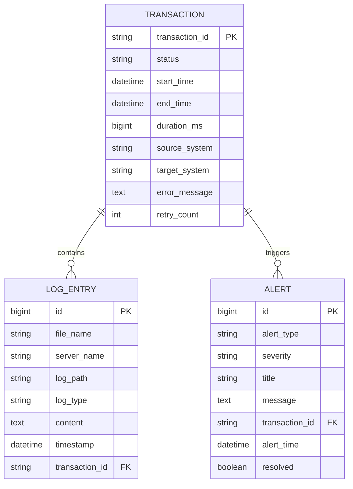

# 企业级日志收集系统 - 开发文档

## 目录
1. [项目概述](#1-项目概述)
2. [系统架构](#2-系统架构)
3. [快速开始](#3-快速开始)
4. [核心模块说明](#4-核心模块说明)
5. [API文档](#5-api文档)
6. [数据库设计](#6-数据库设计)
7. [配置说明](#7-配置说明)
8. [开发指南](#8-开发指南)
9. [测试指南](#9-测试指南)
10. [部署指南](#10-部署指南)
11. [运维手册](#11-运维手册)
12. [故障排查](#12-故障排查)
13. [性能优化](#13-性能优化)
14. [安全指南](#14-安全指南)
15. [版本历史](#15-版本历史)

---

## 1. 项目概述

### 1.1 项目简介
企业级日志收集系统是一个基于Spring Boot 3开发的分布式日志收集、分析和可视化平台。系统通过SSH协议从多个Linux服务器收集日志，使用Kafka进行消息传递，支持实时交易流程分析和告警。

### 1.2 技术栈
- **后端框架**: Spring Boot 3.2.0, Spring Cloud 2023.0.0
- **消息队列**: Apache Kafka
- **数据库**: MySQL 8.0 (主存储), Redis (缓存), Elasticsearch (日志检索)
- **存储**: MinIO (归档存储)
- **监控**: Prometheus + Grafana
- **认证**: Keycloak (OAuth2/OIDC)
- **容器化**: Docker, Docker Compose
- **构建工具**: Maven 3.8+
- **Java版本**: JDK 17

### 1.3 功能特性
- ✅ 多服务器SSH日志收集
- ✅ 实时交易流程分析
- ✅ 分布式消息处理 (Kafka)
- ✅ 多级存储策略 (热数据/冷数据)
- ✅ 智能告警系统
- ✅ 自动日志归档
- ✅ OAuth2认证授权
- ✅ Prometheus指标监控
- ✅ RESTful API
- ✅ WebSocket实时推送
- ✅ 可视化交易流程图

---

## 2. 系统架构

### 2.1 整体架构图
```
┌─────────────────────────────────────────────────────────────┐
│                         前端展示层                            │
│  (React/Vue Dashboard, Grafana, Admin Portal)              │
└─────────────────────────────────────────────────────────────┘
                              ▼
┌─────────────────────────────────────────────────────────────┐
│                      API Gateway层                          │
│           (Spring Cloud Gateway + Keycloak)                │
└─────────────────────────────────────────────────────────────┘
                              ▼
┌─────────────────────────────────────────────────────────────┐
│                      应用服务层                              │
│  ┌──────────┐  ┌──────────┐  ┌──────────┐  ┌──────────┐  │
│  │日志收集器│  │日志处理器│  │告警服务  │  │归档服务  │  │
│  └──────────┘  └──────────┘  └──────────┘  └──────────┘  │
└─────────────────────────────────────────────────────────────┘
                              ▼
┌─────────────────────────────────────────────────────────────┐
│                      消息队列层                              │
│                    (Apache Kafka)                           │
└─────────────────────────────────────────────────────────────┘
                              ▼
┌─────────────────────────────────────────────────────────────┐
│                       存储层                                 │
│  ┌────────┐  ┌────────┐  ┌──────────────┐  ┌────────┐    │
│  │ MySQL  │  │ Redis  │  │Elasticsearch │  │ MinIO  │    │
│  └────────┘  └────────┘  └──────────────┘  └────────┘    │
└─────────────────────────────────────────────────────────────┘
```

### 2.2 数据流向
1. **日志收集**: SSH → Log Collector → Kafka
2. **日志处理**: Kafka → Log Processor → MySQL/ES
3. **实时分析**: MySQL → Transaction Analyzer → WebSocket
4. **告警流程**: Analyzer → Alert Service → Email/Webhook
5. **数据归档**: MySQL → Archive Service → MinIO

### 2.3 核心组件说明

| 组件 | 职责 | 技术 |
|-----|------|------|
| LogCollectorService | SSH连接和日志采集 | JSch, Spring Scheduler |
| KafkaProducerService | 消息生产 | Spring Kafka |
| KafkaConsumerService | 消息消费 | Spring Kafka |
| LogProcessorService | 日志解析处理 | 正则表达式, JPA |
| TransactionAnalyzer | 交易流程分析 | JPA, Graph算法 |
| AlertService | 告警检测和通知 | Spring Mail, RestTemplate |
| ArchiveService | 数据归档 | MinIO Client, GZIP |
| MetricsService | 监控指标收集 | Micrometer |

---

## 3. 快速开始

### 3.1 环境要求
```bash
# 检查Java版本
java -version  # 需要 JDK 17+

# 检查Maven版本  
mvn -version   # 需要 3.8+

# 检查Docker版本
docker --version  # 需要 20.10+
docker-compose --version  # 需要 2.0+
```

### 3.2 克隆项目
```bash
git clone https://github.com/your-org/log-collector-enterprise.git
cd log-collector-enterprise
```

### 3.3 配置环境变量
```bash
# 复制环境变量模板
cp .env.example .env

# 编辑配置文件
vim .env
```

**.env 文件内容:**
```properties
# 服务器SSH配置
SERVER_USERNAME=your-ssh-username
SERVER_PASSWORD=your-ssh-password

# 数据库配置
MYSQL_ROOT_PASSWORD=strong-password-here
MYSQL_DATABASE=logdb
MYSQL_USER=loguser
MYSQL_PASSWORD=logpass

# Kafka配置
KAFKA_BROKER_ID=1
KAFKA_ZOOKEEPER_CONNECT=zookeeper:2181

# Redis配置
REDIS_PASSWORD=redis-password

# Elasticsearch配置
ELASTIC_PASSWORD=elastic-password

# MinIO配置
MINIO_ROOT_USER=minioadmin
MINIO_ROOT_PASSWORD=minioadmin

# Keycloak配置
KEYCLOAK_ADMIN=admin
KEYCLOAK_ADMIN_PASSWORD=admin
```

### 3.4 启动基础设施
```bash
# 启动所有依赖服务
docker-compose up -d mysql redis kafka elasticsearch minio keycloak prometheus grafana

# 等待服务就绪（约30秒）
./scripts/wait-for-services.sh
```

### 3.5 初始化数据库
```bash
# 运行数据库迁移脚本
mvn flyway:migrate
```

### 3.6 配置Keycloak
```bash
# 1. 访问 Keycloak 管理控制台
open http://localhost:8180

# 2. 登录 (admin/admin)

# 3. 创建 Realm
- 点击 "Create Realm"
- Name: log-monitor
- 点击 "Create"

# 4. 创建 Client
- Clients → Create
- Client ID: log-collector-client
- Client Protocol: openid-connect
- 点击 "Save"

# 5. 配置 Client
- Access Type: confidential
- Valid Redirect URIs: http://localhost:8080/*
- 点击 "Save"
- 复制 Secret 到 application.yml

# 6. 创建角色
- Roles → Add Role
- 创建: ADMIN, USER

# 7. 创建测试用户
- Users → Add User
- Username: testuser
- 设置密码
- 分配角色
```

### 3.7 构建和运行应用
```bash
# 构建项目
mvn clean package -DskipTests

# 运行应用（开发模式）
mvn spring-boot:run

# 或使用Docker运行
docker build -t log-collector:latest .
docker-compose up -d log-collector
```

### 3.8 验证安装
```bash
# 健康检查
curl http://localhost:8080/actuator/health

# 获取认证Token
TOKEN=$(curl -X POST http://localhost:8180/realms/log-monitor/protocol/openid-connect/token \
  -H "Content-Type: application/x-www-form-urlencoded" \
  -d "client_id=log-collector-client" \
  -d "client_secret=YOUR_SECRET" \
  -d "username=testuser" \
  -d "password=testpass" \
  -d "grant_type=password" | jq -r '.access_token')

# 测试API调用
curl -H "Authorization: Bearer $TOKEN" http://localhost:8080/api/transactions
```

---

## 4. 核心模块说明

### 4.1 日志收集模块

**类**: `LogCollectorService`
**职责**: 通过SSH从远程服务器收集日志文件

```java
// 核心方法
public void collectLogs() {
    // 1. 建立SSH连接
    // 2. 列出日志文件
    // 3. 读取新增内容
    // 4. 发送到Kafka
}
```

**配置参数**:
- `log-collection.interval`: 收集间隔（毫秒）
- `log-collection.batch-size`: 批处理大小
- `log-collection.parallel`: 是否并行收集

### 4.2 消息处理模块

**Kafka Topic设计**:
| Topic | 用途 | 分区数 | 保留时间 |
|-------|------|--------|----------|
| log-raw-topic | 原始日志 | 10 | 7天 |
| log-processed-topic | 处理后日志 | 5 | 30天 |
| alert-topic | 告警消息 | 3 | 3天 |

### 4.3 日志解析模块

**正则表达式模式**:
```java
// 交易ID提取
Pattern TXN_PATTERN = Pattern.compile("TXN_ID[:\\s]+([A-Z0-9]+)");

// 时间戳提取
Pattern TIMESTAMP_PATTERN = Pattern.compile("(\\d{4}-\\d{2}-\\d{2}\\s+\\d{2}:\\d{2}:\\d{2})");

// 错误信息提取
Pattern ERROR_PATTERN = Pattern.compile("ERROR|EXCEPTION|Failed", Pattern.CASE_INSENSITIVE);
```

### 4.4 告警规则引擎

**告警规则配置**:
```yaml
alert-rules:
  - id: high-error-rate
    condition: "errorRate > 0.1"
    window: 5m
    severity: CRITICAL
    actions: [email, webhook, sms]
    
  - id: transaction-timeout
    condition: "duration > 30000"
    severity: WARNING
    actions: [email]
    
  - id: system-down
    condition: "healthCheck == false"
    severity: CRITICAL
    actions: [email, webhook, sms, phone]
```

---

## 5. API文档

### 5.1 认证API

#### 获取Token
```http
POST /auth/token
Content-Type: application/json

{
    "username": "user@example.com",
    "password": "password"
}

Response:
{
    "access_token": "eyJhbGciOiJIUzI1...",
    "token_type": "Bearer",
    "expires_in": 3600
}
```

### 5.2 交易API

#### 获取交易列表
```http
GET /api/transactions?page=0&size=20&sort=startTime,desc
Authorization: Bearer {token}

Response:
{
    "content": [
        {
            "transactionId": "TXN20250118001",
            "status": "SUCCESS",
            "startTime": "2025-01-18T10:00:00",
            "endTime": "2025-01-18T10:00:15",
            "durationMs": 15000
        }
    ],
    "totalElements": 1000,
    "totalPages": 50,
    "number": 0
}
```

#### 获取交易详情
```http
GET /api/transactions/{transactionId}
Authorization: Bearer {token}

Response:
{
    "transactionId": "TXN20250118001",
    "status": "SUCCESS",
    "startTime": "2025-01-18T10:00:00",
    "endTime": "2025-01-18T10:00:15",
    "durationMs": 15000,
    "sourceSystem": "APP_SERVER",
    "targetSystem": "GATEWAY",
    "logEntries": [...],
    "flow": {
        "nodes": [...],
        "edges": [...]
    }
}
```

#### 获取交易流程图
```http
GET /api/transactions/{transactionId}/flow
Authorization: Bearer {token}

Response:
{
    "transactionId": "TXN20250118001",
    "nodes": [
        {
            "id": "node_1",
            "label": "APP_SERVER_MAIN_APP",
            "type": "application",
            "startTime": "2025-01-18T10:00:00"
        }
    ],
    "edges": [
        {
            "from": "node_1",
            "to": "node_2",
            "timestamp": "2025-01-18T10:00:05"
        }
    ],
    "mermaid": {
        "diagram": "graph LR\n    APP[应用服务器]-->GW[网关]",
        "nodeCount": 2
    }
}
```

### 5.3 日志API

#### 搜索日志
```http
POST /api/logs/search
Authorization: Bearer {token}
Content-Type: application/json

{
    "query": "ERROR transaction failed",
    "startTime": "2025-01-18T00:00:00",
    "endTime": "2025-01-18T23:59:59",
    "servers": ["APP_SERVER"],
    "logTypes": ["MAIN_APP", "LEDGER"]
}

Response:
{
    "hits": [
        {
            "id": 12345,
            "fileName": "64701.log",
            "serverName": "APP_SERVER",
            "content": "...",
            "timestamp": "2025-01-18T10:00:00",
            "highlight": "ERROR transaction <em>failed</em>"
        }
    ],
    "total": 42
}
```

### 5.4 告警API

#### 获取活跃告警
```http
GET /api/alerts/active
Authorization: Bearer {token}

Response:
{
    "alerts": [
        {
            "id": 1,
            "type": "HIGH_ERROR_RATE",
            "severity": "CRITICAL",
            "title": "高错误率告警",
            "message": "系统APP_SERVER在5分钟内出现15次错误",
            "alertTime": "2025-01-18T10:00:00",
            "resolved": false
        }
    ]
}
```

#### 确认告警
```http
POST /api/alerts/{alertId}/acknowledge
Authorization: Bearer {token}

Response:
{
    "success": true,
    "message": "Alert acknowledged"
}
```

### 5.5 归档API

#### 触发手动归档
```http
POST /api/admin/archive
Authorization: Bearer {token}

{
    "cutoffDays": 30,
    "compress": true
}

Response:
{
    "archived": {
        "transactions": 1500,
        "logEntries": 50000
    },
    "files": [
        "transactions_20250118_120000.json.gz",
        "logs_20250118_120000.json.gz"
    ]
}
```

#### 获取归档文件列表
```http
GET /api/admin/archive/files?prefix=2025-01
Authorization: Bearer {token}

Response:
{
    "files": [
        {
            "name": "transactions_20250101.json.gz",
            "size": 1048576,
            "lastModified": "2025-01-01T02:00:00"
        }
    ]
}
```

### 5.6 监控API

#### 获取系统指标
```http
GET /api/metrics
Authorization: Bearer {token}

Response:
{
    "logs": {
        "processedTotal": 1000000,
        "errorTotal": 100,
        "processingRate": 100.5
    },
    "transactions": {
        "active": 50,
        "successRate": 0.95,
        "averageDuration": 1500
    },
    "system": {
        "cpu": 45.2,
        "memory": 67.8,
        "disk": 35.5
    }
}
```

---

## 6. 数据库设计

### 6.1 ER图


### 6.2 索引设计
```sql
-- 交易表索引
CREATE INDEX idx_transaction_status ON transactions(status);
CREATE INDEX idx_transaction_start_time ON transactions(start_time);
CREATE INDEX idx_transaction_source ON transactions(source_system);

-- 日志表索引
CREATE INDEX idx_log_timestamp ON log_entries(timestamp);
CREATE INDEX idx_log_transaction ON log_entries(transaction_id);
CREATE INDEX idx_log_server ON log_entries(server_name, log_type);
CREATE FULLTEXT INDEX idx_log_content ON log_entries(content);

-- 告警表索引
CREATE INDEX idx_alert_time ON alerts(alert_time);
CREATE INDEX idx_alert_resolved ON alerts(resolved);
CREATE INDEX idx_alert_severity ON alerts(severity);
```

### 6.3 分区策略
```sql
-- 按月分区日志表
ALTER TABLE log_entries_partitioned 
PARTITION BY RANGE (YEAR(timestamp) * 100 + MONTH(timestamp)) (
    PARTITION p202501 VALUES LESS THAN (202502),
    PARTITION p202502 VALUES LESS THAN (202503),
    -- ...更多分区
    PARTITION p_future VALUES LESS THAN MAXVALUE
);

-- 自动添加分区的存储过程
DELIMITER $$
CREATE PROCEDURE create_monthly_partitions()
BEGIN
    DECLARE next_month INT;
    SET next_month = YEAR(NOW()) * 100 + MONTH(NOW()) + 1;
    
    SET @sql = CONCAT('ALTER TABLE log_entries_partitioned ',
                     'ADD PARTITION (PARTITION p', next_month,
                     ' VALUES LESS THAN (', next_month + 1, '))');
    PREPARE stmt FROM @sql;
    EXECUTE stmt;
    DEALLOCATE PREPARE stmt;
END$$
DELIMITER ;

-- 定期执行
CREATE EVENT create_partitions_event
ON SCHEDULE EVERY 1 MONTH
DO CALL create_monthly_partitions();
```

---

## 7. 配置说明

### 7.1 应用配置层次
```
application.yml (基础配置)
    ├── application-dev.yml (开发环境)
    ├── application-test.yml (测试环境)
    ├── application-prod.yml (生产环境)
    └── application-docker.yml (Docker环境)
```

### 7.2 关键配置项说明

#### 日志收集配置
```yaml
log-collection:
  interval: 30000          # 收集间隔(ms)
  batch-size: 500         # 批次大小
  parallel: true          # 并行处理
  thread-pool-size: 10    # 线程池大小
  timeout: 60000          # SSH超时时间(ms)
  retry-times: 3          # 重试次数
  file-pattern: "*.log"   # 文件匹配模式
```

#### Kafka配置
```yaml
spring:
  kafka:
    producer:
      batch-size: 16384           # 批量发送大小
      linger-ms: 10               # 延迟发送时间
      compression-type: snappy     # 压缩算法
      acks: all                   # 确认级别
      
    consumer:
      max-poll-records: 500       # 单次拉取最大记录数
      fetch-min-size: 1           # 最小拉取字节数
      session-timeout-ms: 30000   # 会话超时
      heartbeat-interval-ms: 3000 # 心跳间隔
```

#### 性能调优配置
```yaml
spring:
  datasource:
    hikari:
      maximum-pool-size: 30       # 最大连接池大小
      minimum-idle: 10            # 最小空闲连接
      connection-timeout: 30000   # 连接超时
      idle-timeout: 600000        # 空闲超时
      max-lifetime: 1800000       # 最大生命周期
      
  task:
    execution:
      pool:
        core-size: 10             # 核心线程数
        max-size: 20              # 最大线程数
        queue-capacity: 1000      # 队列容量
```

---

## 8. 开发指南

### 8.1 开发环境搭建

#### IDE配置 (IntelliJ IDEA)
1. 安装插件：
   - Spring Boot Assistant
   - Lombok Plugin
   - Docker Plugin
   - Database Tools

2. 导入项目：
   - File → Open → 选择项目根目录
   - 等待Maven依赖下载完成

3. 配置运行环境：
   - Run → Edit Configurations
   - Add → Spring Boot
   - Main class: `LogCollectorApplication`
   - Active profiles: `dev`

#### VS Code配置
```json
// .vscode/settings.json
{
    "java.configuration.updateBuildConfiguration": "automatic",
    "java.compile.nullAnalysis.mode": "automatic",
    "spring-boot.ls.java.home": "/path/to/jdk17",
    "files.exclude": {
        "**/.git": true,
        "**/.DS_Store": true,
        "**/target": true
    }
}

// .vscode/launch.json
{
    "configurations": [
        {
            "type": "java",
            "name": "Spring Boot App",
            "request": "launch",
            "mainClass": "com.example.logcollector.LogCollectorApplication",
            "projectName": "log-collector-enterprise",
            "args": "--spring.profiles.active=dev"
        }
    ]
}
```

### 8.2 代码规范

#### 命名规范
- 类名：PascalCase (例: `LogCollectorService`)
- 方法名：camelCase (例: `collectLogs`)
- 常量：UPPER_SNAKE_CASE (例: `MAX_RETRY_COUNT`)
- 包名：全小写 (例: `com.example.logcollector`)

#### 注释规范
```java
/**
 * 日志收集服务
 * 负责从远程服务器通过SSH收集日志文件
 * 
 * @author Your Name
 * @since 1.0.0
 */
@Service
@Slf4j
public class LogCollectorService {
    
    /**
     * 收集所有配置的服务器日志
     * 
     * @throws LogCollectionException 当收集失败时抛出
     */
    @Scheduled(fixedDelayString = "${log-collection.interval}")
    public void collectLogs() {
        // TODO: 实现日志收集逻辑
    }
}
```

### 8.3 添加新功能示例

#### 示例：添加日志过滤功能

1. **创建过滤器接口**
```java
package com.example.logcollector.filter;

public interface LogFilter {
    boolean accept(LogEntry entry);
    int getPriority();
}
```

2. **实现具体过滤器**
```java
@Component
public class ErrorLogFilter implements LogFilter {
    @Override
    public boolean accept(LogEntry entry) {
        return entry.getContent().contains("ERROR");
    }
    
    @Override
    public int getPriority() {
        return 100;
    }
}
```

3. **注册到处理链**
```java
@Service
public class LogProcessorService {
    @Autowired
    private List<LogFilter> filters;
    
    public void processLog(LogEntry entry) {
        // 应用过滤器
        boolean accepted = filters.stream()
            .sorted(Comparator.comparing(LogFilter::getPriority))
            .allMatch(filter -> filter.accept(entry));
            
        if (accepted) {
            // 处理日志
        }
    }
}
```

### 8.4 调试技巧

#### 远程调试
```bash
# 启动应用时开启调试端口
java -agentlib:jdwp=transport=dt_socket,server=y,suspend=n,address=*:5005 -jar target/log-collector.jar
```

#### 日志级别调整
```yaml
# application-dev.yml
logging:
  level:
    com.example.logcollector: DEBUG
    org.springframework.kafka: DEBUG
    org.hibernate.SQL: DEBUG
    org.hibernate.type: TRACE
```

#### 使用Actuator端点
```bash
# 查看所有Bean
curl http://localhost:8080/actuator/beans

# 查看配置
curl http://localhost:8080/actuator/configprops

# 查看健康状态
curl http://localhost:8080/actuator/health

# 查看指标
curl http://localhost:8080/actuator/metrics
```

---

## 9. 测试指南

### 9.1 单元测试

#### Service层测试示例
```java
@SpringBootTest
@AutoConfigureMockMvc
class LogCollectorServiceTest {
    
    @MockBean
    private KafkaProducerService kafkaProducerService;
    
    @Autowired
    private LogCollectorService logCollectorService;
    
    @Test
    void testCollectLogs() {
        // Given
        LogEntry expectedEntry = new LogEntry();
        expectedEntry.setTransactionId("TXN001");
        
        // When
        logCollectorService.collectLogs();
        
        // Then
        verify(kafkaProducerService, times(1))
            .sendRawLog(any(LogEntry.class));
    }
}
```

#### Repository层测试
```java
@DataJpaTest
class TransactionRepositoryTest {
    
    @Autowired
    private TestEntityManager entityManager;
    
    @Autowired
    private TransactionRepository repository;
    
    @Test
    void testFindByStatus() {
        // Given
        Transaction transaction = new Transaction();
        transaction.setTransactionId("TXN001");
        transaction.setStatus(TransactionStatus.SUCCESS);
        entityManager.persistAndFlush(transaction);
        
        // When
        List<Transaction> found = repository.findByStatus(TransactionStatus.SUCCESS);
        
        // Then
        assertThat(found).hasSize(1);
        assertThat(found.get(0).getTransactionId()).isEqualTo("TXN001");
    }
}
```

### 9.2 集成测试

```java
@SpringBootTest(webEnvironment = SpringBootTest.WebEnvironment.RANDOM_PORT)
@TestPropertySource(locations = "classpath:application-test.yml")
class TransactionControllerIntegrationTest {
    
    @Autowired
    private TestRestTemplate restTemplate;
    
    @Test
    @WithMockUser(roles = "USER")
    void testGetTransactions() {
        ResponseEntity<PagedTransactionResponse> response = 
            restTemplate.getForEntity("/api/transactions", PagedTransactionResponse.class);
            
        assertThat(response.getStatusCode()).isEqualTo(HttpStatus.OK);
        assertThat(response.getBody()).isNotNull();
    }
}
```

### 9.3 性能测试

```java
@Test
@PerfTest(invocations = 1000, threads = 20)
@Required(max = 1200, average = 250)
public void testLogProcessingPerformance() {
    LogEntry entry = createTestLogEntry();
    logProcessorService.processLog(entry);
}
```

### 9.4 测试数据生成

```bash
# 生成测试日志文件
./scripts/generate-test-logs.sh --count 10000 --servers 2

# 生成负载测试
./scripts/load-test.sh --users 100 --duration 300
```

---

## 10. 部署指南

### 10.1 Docker部署

#### Dockerfile
```dockerfile
FROM openjdk:17-jdk-slim
WORKDIR /app
COPY target/*.jar app.jar
EXPOSE 8080
ENTRYPOINT ["java", "-jar", "app.jar"]
```

#### docker-compose.yml (生产环境)
```yaml
version: '3.8'

services:
  log-collector:
    image: log-collector:latest
    environment:
      SPRING_PROFILES_ACTIVE: prod
      JAVA_OPTS: "-Xms2g -Xmx4g -XX:+UseG1GC"
    ports:
      - "8080:8080"
    volumes:
      - ./logs:/app/logs
    deploy:
      replicas: 3
      resources:
        limits:
          cpus: '2'
          memory: 4G
        reservations:
          cpus: '1'
          memory: 2G
```

### 10.2 Kubernetes部署

#### deployment.yaml
```yaml
apiVersion: apps/v1
kind: Deployment
metadata:
  name: log-collector
  namespace: log-system
spec:
  replicas: 3
  selector:
    matchLabels:
      app: log-collector
  template:
    metadata:
      labels:
        app: log-collector
    spec:
      containers:
      - name: log-collector
        image: log-collector:latest
        ports:
        - containerPort: 8080
        env:
        - name: SPRING_PROFILES_ACTIVE
          value: "prod"
        resources:
          requests:
            memory: "2Gi"
            cpu: "1000m"
          limits:
            memory: "4Gi"
            cpu: "2000m"
        livenessProbe:
          httpGet:
            path: /actuator/health/liveness
            port: 8080
          initialDelaySeconds: 30
          periodSeconds: 10
        readinessProbe:
          httpGet:
            path: /actuator/health/readiness
            port: 8080
          initialDelaySeconds: 30
          periodSeconds: 10
```

#### service.yaml
```yaml
apiVersion: v1
kind: Service
metadata:
  name: log-collector-service
  namespace: log-system
spec:
  selector:
    app: log-collector
  ports:
  - protocol: TCP
    port: 80
    targetPort: 8080
  type: LoadBalancer
```

### 10.3 CI/CD Pipeline

#### Jenkinsfile
```groovy
pipeline {
    agent any
    
    environment {
        DOCKER_REGISTRY = 'your-registry.com'
        IMAGE_NAME = 'log-collector'
    }
    
    stages {
        stage('Checkout') {
            steps {
                git branch: 'main', 
                    url: 'https://github.com/your-org/log-collector.git'
            }
        }
        
        stage('Build') {
            steps {
                sh 'mvn clean package'
            }
        }
        
        stage('Test') {
            steps {
                sh 'mvn test'
            }
            post {
                always {
                    junit 'target/surefire-reports/*.xml'
                }
            }
        }
        
        stage('SonarQube Analysis') {
            steps {
                withSonarQubeEnv('SonarQube') {
                    sh 'mvn sonar:sonar'
                }
            }
        }
        
        stage('Build Docker Image') {
            steps {
                sh """
                    docker build -t ${DOCKER_REGISTRY}/${IMAGE_NAME}:${BUILD_NUMBER} .
                    docker tag ${DOCKER_REGISTRY}/${IMAGE_NAME}:${BUILD_NUMBER} \
                               ${DOCKER_REGISTRY}/${IMAGE_NAME}:latest
                """
            }
        }
        
        stage('Push to Registry') {
            steps {
                withCredentials([usernamePassword(
                    credentialsId: 'docker-registry',
                    usernameVariable: 'USERNAME',
                    passwordVariable: 'PASSWORD'
                )]) {
                    sh """
                        docker login -u ${USERNAME} -p ${PASSWORD} ${DOCKER_REGISTRY}
                        docker push ${DOCKER_REGISTRY}/${IMAGE_NAME}:${BUILD_NUMBER}
                        docker push ${DOCKER_REGISTRY}/${IMAGE_NAME}:latest
                    """
                }
            }
        }
        
        stage('Deploy to Kubernetes') {
            steps {
                sh """
                    kubectl set image deployment/log-collector \
                            log-collector=${DOCKER_REGISTRY}/${IMAGE_NAME}:${BUILD_NUMBER} \
                            -n log-system
                    kubectl rollout status deployment/log-collector -n log-system
                """
            }
        }
    }
    
    post {
        success {
            emailext subject: "Build Successful: ${env.JOB_NAME} - ${env.BUILD_NUMBER}",
                     body: "The build was successful.",
                     to: 'team@example.com'
        }
        failure {
            emailext subject: "Build Failed: ${env.JOB_NAME} - ${env.BUILD_NUMBER}",
                     body: "The build failed. Please check the logs.",
                     to: 'team@example.com'
        }
    }
}
```

---

## 11. 运维手册

### 11.1 日常运维任务

#### 健康检查脚本
```bash
#!/bin/bash
# health-check.sh

SERVICES=("log-collector" "mysql" "redis" "kafka" "elasticsearch")

for service in "${SERVICES[@]}"; do
    if docker-compose ps | grep -q "$service.*Up"; then
        echo "✅ $service is running"
    else
        echo "❌ $service is down"
        # 发送告警
        curl -X POST https://alert-webhook.com -d "service=$service&status=down"
    fi
done
```

#### 日志轮转配置
```xml
<!-- logback-spring.xml -->
<configuration>
    <appender name="FILE" class="ch.qos.logback.core.rolling.RollingFileAppender">
        <file>logs/application.log</file>
        <rollingPolicy class="ch.qos.logback.core.rolling.TimeBasedRollingPolicy">
            <fileNamePattern>logs/application.%d{yyyy-MM-dd}.%i.log.gz</fileNamePattern>
            <maxHistory>30</maxHistory>
            <totalSizeCap>10GB</totalSizeCap>
            <timeBasedFileNamingAndTriggeringPolicy
                class="ch.qos.logback.core.rolling.SizeAndTimeBasedFNATP">
                <maxFileSize>100MB</maxFileSize>
            </timeBasedFileNamingAndTriggeringPolicy>
        </rollingPolicy>
        <encoder>
            <pattern>%d{yyyy-MM-dd HH:mm:ss.SSS} [%thread] %-5level %logger{36} - %msg%n</pattern>
        </encoder>
    </appender>
    
    <root level="INFO">
        <appender-ref ref="FILE"/>
    </root>
</configuration>
```

### 11.2 备份和恢复

#### 数据库备份脚本
```bash
#!/bin/bash
# backup-database.sh

DATE=$(date +%Y%m%d_%H%M%S)
BACKUP_DIR="/backup/mysql"
DB_NAME="logdb"

# 创建备份
docker exec mysql mysqldump -u root -p$MYSQL_ROOT_PASSWORD $DB_NAME | \
    gzip > $BACKUP_DIR/backup_$DATE.sql.gz

# 保留最近30天的备份
find $BACKUP_DIR -name "*.sql.gz" -mtime +30 -delete

# 上传到S3
aws s3 cp $BACKUP_DIR/backup_$DATE.sql.gz s3://backup-bucket/mysql/
```

#### 恢复脚本
```bash
#!/bin/bash
# restore-database.sh

BACKUP_FILE=$1
DB_NAME="logdb"

# 从S3下载备份
aws s3 cp s3://backup-bucket/mysql/$BACKUP_FILE /tmp/

# 恢复数据库
gunzip < /tmp/$BACKUP_FILE | docker exec -i mysql mysql -u root -p$MYSQL_ROOT_PASSWORD $DB_NAME
```

### 11.3 监控告警配置

#### Prometheus告警规则
```yaml
# alerts.yml
groups:
  - name: log-collector
    interval: 30s
    rules:
      - alert: HighErrorRate
        expr: rate(logs_errors_total[5m]) > 0.1
        for: 5m
        labels:
          severity: warning
        annotations:
          summary: "High error rate detected"
          description: "Error rate is {{ $value }} errors per second"
          
      - alert: ServiceDown
        expr: up{job="log-collector"} == 0
        for: 1m
        labels:
          severity: critical
        annotations:
          summary: "Service {{ $labels.instance }} is down"
          
      - alert: HighMemoryUsage
        expr: process_resident_memory_bytes > 3e9
        for: 5m
        labels:
          severity: warning
        annotations:
          summary: "High memory usage"
          description: "Memory usage is {{ $value | humanize }}"
```

---

## 12. 故障排查

### 12.1 常见问题

#### 问题1：SSH连接失败
**症状**：日志显示 "Connection refused" 或 "Auth fail"

**解决方案**：
```bash
# 1. 检查SSH服务
ssh -v user@server

# 2. 验证凭证
echo $SERVER_USERNAME
echo $SERVER_PASSWORD

# 3. 检查防火墙
sudo iptables -L | grep 22

# 4. 查看应用日志
docker logs log-collector | grep SSH
```

#### 问题2：Kafka消息积压
**症状**：消费者延迟增加，处理速度下降

**解决方案**：
```bash
# 1. 查看消费者组状态
docker exec kafka kafka-consumer-groups.sh \
    --bootstrap-server localhost:9092 \
    --group log-processor-group \
    --describe

# 2. 重置偏移量
docker exec kafka kafka-consumer-groups.sh \
    --bootstrap-server localhost:9092 \
    --group log-processor-group \
    --reset-offsets --to-latest \
    --execute --all-topics

# 3. 增加消费者实例
docker-compose scale log-collector=5
```

#### 问题3：内存溢出
**症状**：应用崩溃，日志显示 OutOfMemoryError

**解决方案**：
```bash
# 1. 生成堆转储
jmap -dump:format=b,file=heap.hprof <pid>

# 2. 分析堆转储
jhat heap.hprof

# 3. 调整JVM参数
export JAVA_OPTS="-Xms4g -Xmx8g -XX:+UseG1GC -XX:MaxGCPauseMillis=200"

# 4. 重启应用
docker-compose restart log-collector
```

### 12.2 性能调试

#### JVM监控
```bash
# 查看GC情况
jstat -gcutil <pid> 1000

# 查看线程状态
jstack <pid> > thread-dump.txt

# 使用JConsole连接
jconsole <pid>
```

#### SQL慢查询分析
```sql
-- 开启慢查询日志
SET GLOBAL slow_query_log = 'ON';
SET GLOBAL long_query_time = 2;

-- 查看慢查询
SELECT * FROM mysql.slow_log;

-- 分析查询计划
EXPLAIN SELECT * FROM transactions WHERE status = 'FAILED';
```

---

## 13. 性能优化

### 13.1 JVM优化

```bash
# 生产环境JVM参数
JAVA_OPTS="
  -server
  -Xms4g
  -Xmx4g
  -XX:+UseG1GC
  -XX:MaxGCPauseMillis=200
  -XX:+ParallelRefProcEnabled
  -XX:+UnlockExperimentalVMOptions
  -XX:+UnlockDiagnosticVMOptions
  -XX:+DisableExplicitGC
  -XX:+AlwaysPreTouch
  -XX:G1NewSizePercent=30
  -XX:G1MaxNewSizePercent=40
  -XX:G1HeapRegionSize=8M
  -XX:G1ReservePercent=20
  -XX:G1HeapWastePercent=5
  -XX:G1MixedGCCountTarget=4
  -XX:InitiatingHeapOccupancyPercent=15
  -XX:G1MixedGCLiveThresholdPercent=90
  -XX:G1RSetUpdatingPauseTimePercent=5
  -XX:SurvivorRatio=32
  -XX:+PerfDisableSharedMem
  -XX:MaxTenuringThreshold=1
  -Dfile.encoding=UTF-8
  -Djava.security.egd=file:/dev/./urandom
"
```

### 13.2 数据库优化

```sql
-- MySQL配置优化
[mysqld]
innodb_buffer_pool_size = 4G
innodb_log_file_size = 256M
innodb_flush_log_at_trx_commit = 2
innodb_flush_method = O_DIRECT
query_cache_size = 128M
query_cache_type = 1
max_connections = 500
thread_cache_size = 50
```

### 13.3 Kafka优化

```properties
# producer优化
batch.size=32768
linger.ms=50
compression.type=lz4
buffer.memory=134217728

# consumer优化
fetch.min.bytes=1024
fetch.max.wait.ms=500
max.partition.fetch.bytes=1048576
session.timeout.ms=30000
```

---

## 14. 安全指南

### 14.1 安全最佳实践

#### 敏感信息加密
```java
@Component
public class EncryptionService {
    
    @Value("${encryption.key}")
    private String encryptionKey;
    
    public String encrypt(String plaintext) {
        // 使用AES加密
        Cipher cipher = Cipher.getInstance("AES/GCM/NoPadding");
        SecretKeySpec key = new SecretKeySpec(encryptionKey.getBytes(), "AES");
        cipher.init(Cipher.ENCRYPT_MODE, key);
        return Base64.getEncoder().encodeToString(cipher.doFinal(plaintext.getBytes()));
    }
}
```

#### SQL注入防护
```java
// 使用参数化查询
@Query("SELECT t FROM Transaction t WHERE t.transactionId = :id")
Optional<Transaction> findByTransactionId(@Param("id") String transactionId);

// 输入验证
@RestController
public class TransactionController {
    @GetMapping("/api/transactions/{id}")
    public Transaction getTransaction(
            @PathVariable @Pattern(regexp = "^[A-Z0-9]+$") String id) {
        // 处理请求
    }
}
```

### 14.2 安全审计

```java
@Aspect
@Component
public class AuditAspect {
    
    @Autowired
    private AuditService auditService;
    
    @Around("@annotation(Audited)")
    public Object audit(ProceedingJoinPoint joinPoint) throws Throwable {
        String user = SecurityContextHolder.getContext()
            .getAuthentication().getName();
        String action = joinPoint.getSignature().getName();
        Object[] args = joinPoint.getArgs();
        
        try {
            Object result = joinPoint.proceed();
            auditService.log(user, action, args, result, true);
            return result;
        } catch (Exception e) {
            auditService.log(user, action, args, e, false);
            throw e;
        }
    }
}
```

---

## 15. 版本历史

### v2.0.0 (2025-01-18)
- ✨ 集成Kafka消息队列
- ✨ 添加MySQL/Redis/ES多级存储
- ✨ 实现自动告警功能
- ✨ 添加日志归档到MinIO
- ✨ 集成Keycloak认证
- ✨ 添加Prometheus监控

### v1.0.0 (2025-01-01)
- 🎉 初始版本发布
- ✨ SSH日志收集
- ✨ 基础日志解析
- ✨ 交易流程分析
- ✨ Web界面展示

---

## 附录A：环境变量列表

| 变量名 | 描述 | 默认值 | 必需 |
|--------|------|--------|------|
| SERVER_USERNAME | SSH用户名 | - | ✓ |
| SERVER_PASSWORD | SSH密码 | - | ✓ |
| MYSQL_ROOT_PASSWORD | MySQL root密码 | - | ✓ |
| KAFKA_BROKERS | Kafka集群地址 | localhost:9092 | ✗ |
| REDIS_HOST | Redis主机 | localhost | ✗ |
| ES_HOST | Elasticsearch主机 | localhost | ✗ |
| MINIO_ENDPOINT | MinIO端点 | http://localhost:9000 | ✗ |
| KEYCLOAK_URL | Keycloak地址 | http://localhost:8180 | ✗ |
| ALERT_EMAIL | 告警邮箱 | - | ✗ |

---

## 附录B：常用命令速查

```bash
# Maven命令
mvn clean install          # 清理并安装
mvn spring-boot:run       # 运行应用
mvn test                  # 运行测试
mvn package -DskipTests   # 打包跳过测试

# Docker命令
docker-compose up -d      # 后台启动所有服务
docker-compose logs -f    # 查看日志
docker-compose ps         # 查看服务状态
docker-compose down       # 停止所有服务

# Kafka命令
kafka-topics.sh --list --bootstrap-server localhost:9092
kafka-console-consumer.sh --topic log-raw-topic --from-beginning
kafka-consumer-groups.sh --list --bootstrap-server localhost:9092

# MySQL命令
mysql -u root -p logdb
SHOW TABLES;
SELECT COUNT(*) FROM transactions;

# Redis命令
redis-cli
KEYS *
GET key
FLUSHALL

# Elasticsearch命令
curl -X GET "localhost:9200/_cat/indices?v"
curl -X GET "localhost:9200/logs/_search?q=error"
```

---

## 联系方式

- 项目仓库：https://github.com/your-org/log-collector-enterprise
- 问题跟踪：https://github.com/your-org/log-collector-enterprise/issues
- 文档站点：https://docs.your-org.com/log-collector
- 技术支持：support@your-org.com
- 团队邮箱：team@your-org.com

---

## 许可证

MIT License

Copyright (c) 2025 Your Organization

---

最后更新：2025-01-18